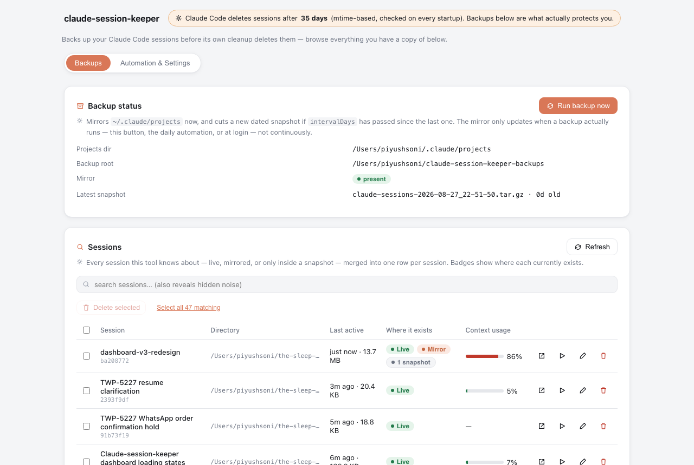
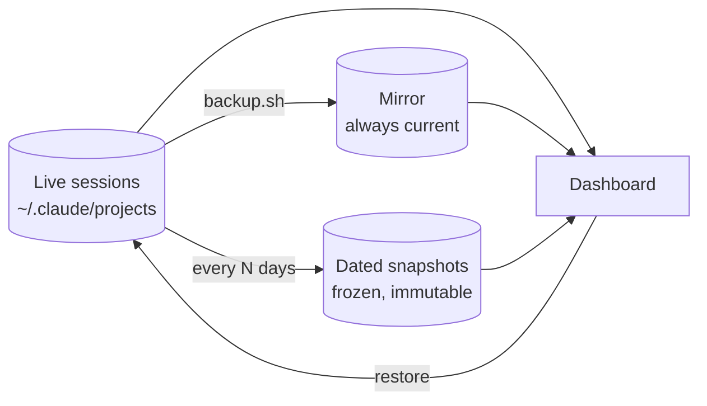
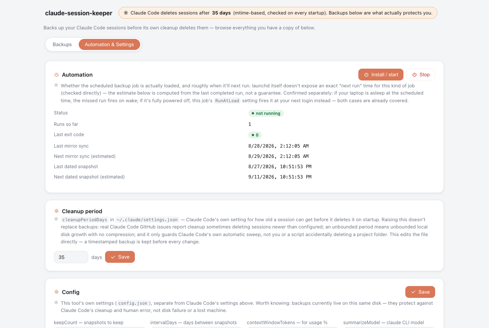
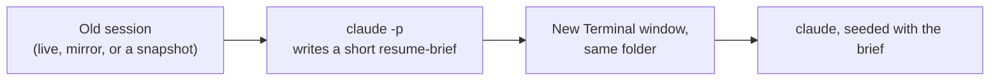

# claude-session-keeper

Claude Code deletes your old session transcripts after 30 days (by
default). This backs them up first, and gives you a small local
dashboard to browse, restore, and pick old sessions back up.



## Why this exists

Claude Code stores every session under `~/.claude/projects/`, and quietly
deletes anything older than `cleanupPeriodDays` every time it starts up.
There are also real reports of it deleting sessions it shouldn't have.
Raising the retention number helps a bit, but it's not real protection —
it only guards against Claude's own cleanup, not you accidentally
deleting a project folder, and it doesn't compress anything either. A
real backup is a different kind of safety net.

## How it works



`backup.sh` keeps a mirror of your live sessions, and every so often
freezes a compressed, dated snapshot that's never touched again. The
dashboard reads all three and merges them into one table, so you can see
every session you have a copy of and restore, rename, or delete it.

## Quick start

```bash
git clone <this-repo>
cd claude-session-keeper
node dashboard/server.js
```

Open `http://localhost:4317`. That's it — no npm install, no build step.

Set up daily automatic backups:

```bash
./scripts/install-launchd.sh
```

(macOS only. Runs `backup.sh` once a day, plus at every login so it
still catches up if your laptop was off.)

## What you can do

- Browse every session you have — live, mirrored, or snapshot-only — in
  one searchable, paginated table
- See at a glance where a session lives (badges: Live / Mirror / N
  snapshots) and how full its context window got
- Restore a session back to `~/.claude/projects` with one click — never
  overwrites something that's already there
- Rename a session, delete one or many, or run a manual backup on demand
- **Continue** an old session in a fresh window (see below)
- Edit Claude Code's cleanup period and this tool's own settings, right
  from the dashboard



## Continue: pick up an old session



Click **Continue** on any session — even one that only exists in a
snapshot — and it asks Claude to write a short summary of what that
session was about, then opens a brand-new terminal in the same project
folder with that summary as the first message. The old session is never
touched or deleted.

## Requirements

- macOS (for opening Terminal windows and the launchd automation —
  backup/restore themselves are plain bash and should work on Linux, just
  untested)
- Node.js 18+
- The `claude` CLI on your `PATH`

## A few things worth knowing

- Search is plain keyword matching, not semantic search
- Very long sessions get truncated before summarizing (~150k characters)
- Backups live on the same disk as your Mac — this protects you from
  Claude Code's cleanup and from accidental deletion, not from a dead
  hard drive
- `titleExcludePatterns` in `config.json` hides noisy sessions (like an
  automated bot's) from the default view — searching still finds them

## Project layout

```
claude-session-keeper/
├── backup.sh, restore.sh       bash — mirror + snapshot, and restoring either
├── config.json                 keepCount, intervalDays, titleExcludePatterns, ...
├── scripts/                     launchd install/stop + plist template
├── lib/                         session parsing, backups, settings, the CLI-continue logic
├── dashboard/                   Node http server + a vanilla JS/CSS frontend
└── test/                        node --test, zero dependencies
```
